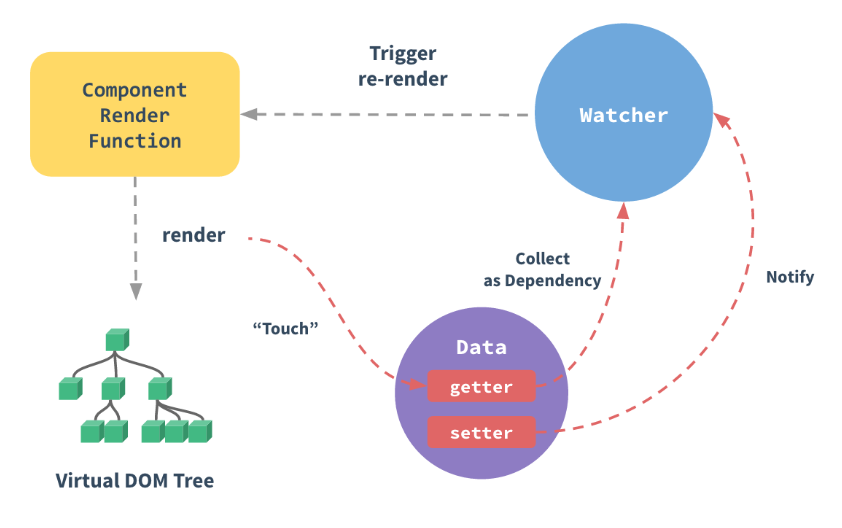

## 介绍
### Vue.js 是什么

Vue (读音 /vjuː/，类似于 **view**) 是一套用于构建用户界面的**渐进式框架**。与其它大型框架不同的是，Vue 被设计为可以自底向上逐层应用。**Vue 的核心库只关注视图层**，不仅易于上手，还便于与第三方库（如：vue-router、vuex、axios等）或既有项目整合。另一方面，当与[现代化的工具链](https://cn.vuejs.org/v2/guide/single-file-components.html)以及各种[支持类库](https://github.com/vuejs/awesome-vue#libraries--plugins)结合使用时，Vue 也完全能够为复杂的单页应用提供驱动。

### MVVM 模式的实现者——双向数据绑定模式

- Model：模型层，在这里表示 JavaScript 对象

- View：视图层，在这里表示 DOM （HTML操作的元素）

- ViewModel：连接视图和数据的中间件，**Vue.js 就是 MVVM 中的 ViewModel 层的实现者**

在 MVVM 架构中，是不允许 **数据 **和 **视图** 直接通信的，只能通过 `ViewModel` 来通信，而 ViewModel 就是定义了一 个 `Observer` 观察者

- ViewModel 能够观察到数据的变化，并对视图对应的内容进行更新

- ViewModel 能够监听到视图的变化，并能够通知数据发生改变

至此，我们就明白，Vue.js 就是一个 MVVM 的实现者，他的核心就是实现了 `DOM 监听` 与 `数据绑定`

### 两大核心要素

- 数据驱动

当把一个普通的 JavaScript 对象传给 Vue 实例的 `data` 属性，Vue 将遍历此对象所有的属性，并使用 `Object.defineProperty` 把这些属性全部转为 `getter/setter`。**Object.defineProperty 是 ES5 中一个无法 shim 的特性，这也是为什么 Vue 不支持 IE8 以及更低版本的浏览器原因。**

这些 getter/setter 对用户来说是不可见的，但是在内部它们让 Vue 追踪依赖，在属性被访问和修改时通知变化。这里需要注意的问题是浏览器控制台在打印数据对象时 getter/setter 的格式化并不同，所以你可能需要安装 `vue-devtools` 来获取更加友好的检查接口。

每个组件实例都有相应的 watcher 实例对象，它会在组件渲染的过程中把属性记录为依赖，之后当依赖项的 `setter` 被调用时，会通知 `watcher` 重新计算，从而致使它关联的组件得以更新。

- 组件化

  1. 页面上每个独立的可交互的区域视为一个组件

  2. 每个组件对应一个工程目录，组件所需的各种资源在这个目录下就近维护

  3. 页面不过是组件的容器，组件可以嵌套自由组合（复用）形成完整的页面

## Vue 实例

### 创建实例

### 生命周期

每个 Vue 实例在被创建时都要经过一系列的初始化过程——例如，需要设置数据监听、编译模板、将实例挂载到 DOM 并在数据变化时更新 DOM 等。同时在这个过程中也会运行一些叫做**生命周期钩子**的函数，这给了用户在不同阶段添加自己的代码的机会。

## 模板语法

## 组件化

### Vue文件三大组成部分

- template —— Html
- script —— JavaScript
- style —— CSS

## 路由